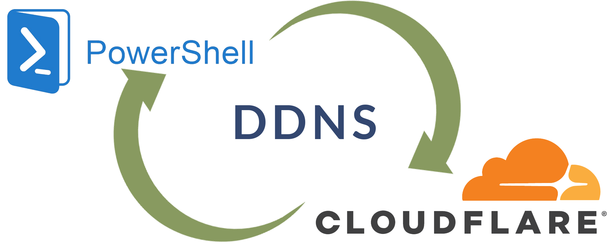

# Cloudflare DDNS service for Windows



DDNS service for cloudflare users with PowerShell

## Creating a Cloudflare API token

To create a CloudFlare API token for your DNS zone go to [https://dash.cloudflare.com/profile/api-tokens](https://dash.cloudflare.com/profile/api-tokens) and follow these steps:

* Click Create Token
* Provide the token a name, for example, cloudflare-ddns
* Grant the token the following permissions:
* `Zone` - `Zone Settings` - `Read`
* `Zone` - `Zone` - `Read`
* `Zone` - `DNS` - `Edit`
* Set the zone resources to:
* Include - All zones

## Getting Started

Copy `eg.vars.ini` to `vars.ini` or whatever you like e.g. `file.ini`

```powershell
Copy-Item -Path eg.vars.ini -Destination vars.ini
```

Edit `vars.ini` and replace the values with your own.

```ini
apiToken=
domain=
subdomain=
```

Complete the wizard and copy the generated token into the `apiToken` variable for the container

* `domain`:  `example.com`
* `subdomain`: `test`

## Deployment

To deploy this project run

```powershell
.\ddns.ps1
```

## Auto Update

Create a task Scheduler task to repeat the task every 5 min to update the record periodically.
