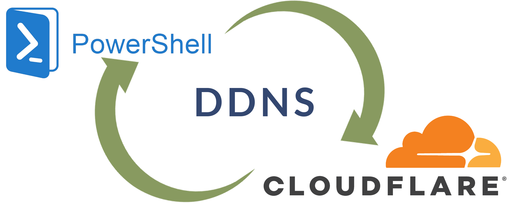

# Cloudflare DDNS service for Windows



DDNS service for cloudflare users with PowerShell

## Getting Started

Copy `eg.vars.ini` to `vars.ini` or whatever you like e.g. `file.ini`

```powershell
Copy-Item -Path eg.vars.ini -Destination vars.ini
```

Edit `vars.ini` and replace the values with your own.

```ini
apiKey= 
email=
zoneID=
record=
recordType=
```

* `apiKey`: Go to your [Cloudflare Profile](https://dash.cloudflare.com/profile/api-tokens) and grab the `API Key`
* `email`: Your Cloudflare Email
* `zoneID`: Go to [Cloudflare Dashboard](https://dash.cloudflare.com/), select the Zone and copy the Zone ID on the right side
* `record`: Full record name e.g exmaple.com or subdomain site1.example.com
* `recordType`: Set this to A (set something else, if you know what you doing)

## Deployment

To deploy this project run

```powershell
ddns.ps1 -varfile vars.ini
```

## Auto Update

Create a task Scheduler task to repeat the task every 5 min to update the record periodically.
